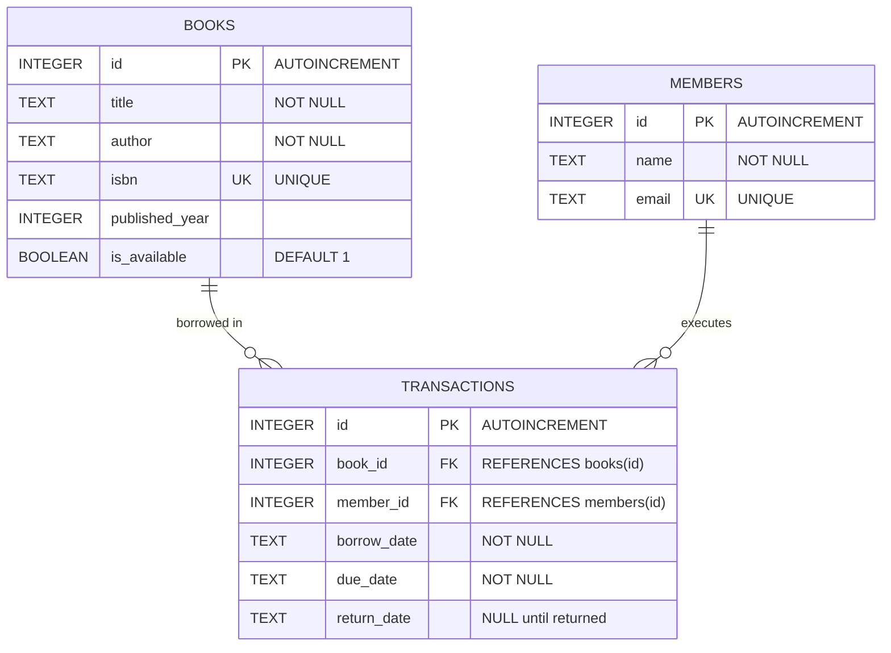

# 📚 Library Management System (LMS)

A robust, console-based Library Management System built with **Python** and **SQLite**. This application provides an end-to-end solution for managing library resources, tracking member registrations, and handling book borrowing and return transactions with automated due-date tracking and relational data integrity.

---

## 🚀 Features

### 📖 Book Management
- **Add New Books**: Register books with Title, Author, ISBN, and Publication Year. Prevents duplicate ISBN entries.
- **View All Books**: Tabular view of all cataloged books along with their current availability status (`Available` or `Borrowed`).
- **Search Books**: Fast search across the catalog by book title or author keyword (case-insensitive substring match).

### 👥 Member Management
- **Register Members**: Add new members with Name and Unique Email.
- **View Members**: List all registered library patrons with their system ID and contact details.

### 🔄 Circulation & Transactions
- **Borrow Books**:
  - Validates book availability and member existence.
  - Automatically calculates a **14-day loan period** and due date.
  - Updates book status from `Available` to `Borrowed`.
  - Records a transaction record linking patron and book.
- **Return Books**:
  - Matches active transactions and marks the return date.
  - Automatically updates book status back to `Available`.
- **Active Loans View**: Displays all currently borrowed books, who borrowed them, borrow date, and upcoming due dates.

---

## 🗄️ Database Architecture & Schema

The application uses an embedded **SQLite3** database (`library.db`) with relational integrity and foreign keys.



### Table Definitions

1. **`books`**: Stores cataloged books and current stock status.
2. **`members`**: Stores library patron profiles.
3. **`transactions`**: Stores borrowing history, active loans, and return timestamps.

---

## 📂 Project Structure

```text
Library project/
│
├── LibraryManagementSystem   # Main executable Python script
├── library.db                # SQLite database file (auto-generated on first run)
└── README.md                 # Project documentation
```

---

## 🛠️ Prerequisites

- **Python 3.7+** installed on your system.
- **No external dependencies** required: uses Python built-in modules (`sqlite3`, `datetime`).

---

## 💻 Installation & Usage

### 1. Clone the Repository
```bash
git clone https://github.com/keerthiyadav181/LMS-Python-SQL.git
cd LMS-Python-SQL
```

### 2. Run the Application
You can run the application directly using Python:

```bash
python LibraryManagementSystem
```

*(Optional: If you prefer running with a `.py` extension, you can rename or run `python library_management_system.py`)*

### 3. Interactive Menu Guide

Upon launching the application, you will be presented with the interactive menu:

```text
==================================================
        LIBRARY MANAGEMENT SYSTEM
==================================================
1.  Add a new book
2.  View all books
3.  Search for a book
4.  Add a new member
5.  View all members
6.  Borrow a book
7.  Return a book
8.  View borrowed books
9.  Exit
==================================================
```

Enter a number between **1** and **9** to perform an action.

---

## 🛡️ Error Handling & Validation

- **Integrity Constraints**: Handles unique constraint errors (e.g., trying to add an already registered ISBN or email).
- **Borrow Rules**: Prevents borrowing a book that is already checked out.
- **Return Validation**: Ensures only active borrow records can be marked returned.
- **Input Sanitization**: Handles invalid data types (such as entering letters for numeric IDs).

---

## 🔮 Future Improvements

- [ ] Fine calculation for overdue returns.
- [ ] Role-based access control (Admin vs. Member views).
- [ ] Export reports to CSV / PDF.
- [ ] Web or GUI interface (Flask/FastAPI or Tkinter/PyQt).

---

## 📄 License

This project is open-source and available under the [MIT License](LICENSE).
